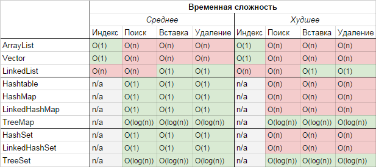

# Java Quiz

## Core Java

### Low coupling and high cohesion

Cohesion refers to what the class (or module) will do.
Low cohesion would mean that the class does a great variety of actions and is not focused on what it should do.
High cohesion would then mean that the class is focused on what it should be doing, i.e. only methods relating to the intention of the class.

Example of Low Cohesion:

```
class Staff {
  boolean checkEmail();
  void sendEmail();
  boolean emailValidate();
  void printLetter();
}
```

Example of High Cohesion:

```
class Staff {
  private Integer salary;
  private String emailAddr;

  void setSalary(newSalary);
  Integer getSalary();
  void setEmailAddr(newEmail);
  String getEmailAddr();
}
```

As for coupling, it refers to how related are two classes / modules and how dependent they are on each other.
Being low coupling would mean that changing something major in one class should not affect the other.
High coupling would make your code difficult to make changes as well as to maintain it, as classes are coupled closely together, making a change could mean an entire system revamp.

All good software design will go for **high cohesion and low coupling**.

### Exception Hierarchy

* checked (red) - must either be caught at compile time or declared in the method's throws clause
* unchecked (green) - not expected to be recovered, such as null pointer, divide by 0, etc.


### Reference types

* strong reference
* soft reference
* weak reference
* phantom reference
  
## Collections


### Map


### List


### Set


### Queue


### Time Complexity



## Concurrency

### Concepts

#### Concurrency vs parallelism

* concurrency - a condition that exists when at least two threads are making progress. A more generalized form of parallelism that can include time-slicing as a form of virtual parallelism
* parallelism - a condition that arises when at least two threads are executing simultaneously

#### synchronization

* control synchronization - when, for example, one task depends on the end of another task, the second task can't start before the first has finished
* data access synchronization - when two or more tasks have access to a shared variable and only one of the tasks can access the variable at any given time

#### synchronization, critical section and mutual exclusion

A concept closely related to synchronization is critical section

* critical section is a piece of code that can be only executed by a task at any given time because of its access to a shared resource
* mutual exclusion is the mechanism used to guarantee this requirement and can be implemented by different ways

#### semaphore, mutex and monitor

Most popular mechanisms to get synchronization from a theoretical point of view are:
* semaphore is a mechanism that can be used to control the access to one or more units of a resource.
 It has a variable that stores the number of resources that can be used and two atomic operations to manage the value of the variable
* mutex (mutual exclusion) is a special kind of semaphore that can take only two values (resource is free and resource is busy), and only the process that sets the mutex to busy can release it
* monitor is a mechanism to get mutual exclusion over a shared resource.
 It has a mutex, a condition variable, and two operations to wait for the condition and to signal the condition.
 Once you signal the condition, only one of the tasks that are waiting for it continues with its execution.

#### thread safety

A piece of code (or a method or an object) is thread-safe if all the users of shared data are protected by synchronization mechanisms, a nonblocking compare-and-swap (CAS) primitive or data is immutable and you can use that code in a concurrent application without any problem

#### immutable object

* immutable object is an object which you can't modify its visible state after its initialization

#### atomic operations and variables

* atomic operation - you can implement an atomic operation with a critical section to the whole operation using a synchronization mechanism
* atomic variable is a kind of variable with atomic operations to set and get its value.
 You can implement an atomic variable using a synchronization mechanism or using CAS

#### shared memory vs message passing

Tasks can use two different methods to communicate with each other:
* shared memory - normally it is used when the tasks are running in the same computer.
 The tasks use the same memory area where they write and read values, the access to this shared memory has to be in a critical section protected by a synchronization mechanism
* message passing - normally is used when the tasks are running in different computers. 
 This communication can be synchronous if the sender is blocked waiting for a response or asynchronous if the sender continues with their execution after sending the message

### Problems

#### Data race and race condition

* **race condition** is a situation, in which the result of an operation depends on the interleaving of certain individual operations
* **data race** is a situation, in which at least two threads access a shared variable at the same time outside the critical sections.
 At least one thread tries to modify the variable

#### Deadlock

* **deadlock** is situation when there are two or more tasks waiting for a shared resource that must be free from the other, so none of them will get the resources they need and will be blocked indefinitely

Coffman's deadlock conditions:
* mutual exclusion - the resources involved in the deadlock must be nonshareable. Only one task can use the resource at a time
* hold and wait condition - a task has the mutual exclusion for a resource and it's requesting the mutual exclusion for another resource. While it's waiting, it doesn't release any resources
* no pre-emption - the resources can only be released by the tasks that hold them
* circular wait - there is a circular waiting where Task 1 is waiting for a resource that is being held by Task 2, which is waiting for a resource being held by Task 3, and so on until we have Task n that is waiting for a resource being held by Task 1

Avoid deadlocks:
* ignore them - this is the most commonly used mechanism. You suppose that a deadlock will never occur on your system, and if it occurs, you can see the consequences of stopping your application and having to re-execute it
* detection - the system has a special task that analyzes the state of the system to detect if a deadlock has occurred.
 If it detects a deadlock, it can take action to remedy the problem. For example, finishing one task or forcing the liberation of a resource.
* prevention - if you want to prevent deadlocks in your system, you have to prevent one or more of Coffman's conditions
* avoidance - deadlocks can be avoided if you have information about the resources that are used by a task before it begins its execution.
 When a task wants to start its execution, you can analyze the resources that are free in the system and the resources that the task needs to decide that it can start its execution or not

#### Livelock

* **livelock** occurs when you have two tasks in your systems that are always changing their states due to the actions of the other.
 For example, you have two tasks—Task 1 and Task 2—and both need two resources: Resource 1 and Resource 2.
 Suppose that Task 1 has a lock on Resource 1, and Task 2 has a lock on Resource 2.
 As they are unable to gain access to the resource they need, they free their resources and begin the cycle again.
 This situation can continue indefinitely, so the tasks will never end their execution

#### Other

* **Resource starvation** occurs when you have a task in your system that never gets a resource that it needs to continue with its execution
* **priority inversion** occurs when a low-priority task holds a resource that is needed by a high-priority task, so the low-priority task finishes its execution before the high-priority task

### Methodology to design concurrent algorithms

* sequential version - starting point, used to compare results and check throughput
* concurrent version

##### Steps

* **analysis**
* **design**

You have to decide how to do that parallelization:
* *task decomposition* when you split the code in two or more independent tasks that can be executed at once.
 Maybe some of these tasks have to be executed in a given order or have to wait at the same point.
 You must use synchronization mechanisms to get this behavior
* *data decomposition* when you have multiple instances of the same task that work with a subset of the dataset.
 This dataset will be a shared resource, so if the tasks need to modify the data you have to protect access to it by implementing a critical section

* **implementation**
* **testing**
* **tuning**

Metrics:

* speedup


* Amdahl's law


* *P* is the percentage of code that can be parallelized
* *N* is the number of cores of the computer where you're going to execute the algorithm

* Gustafson-Barsis' law


## Concurrency API

Basic elements:
* Thread
* Lock
* Semaphore

High-level mechanisms:
* executor framework
* parallel Stream API

### Basic concurrency classes

* **Thread** represents all the threads that execute a concurrent Java application
* **Runnable** is another way to create concurrent applications in Java
* **ThreadLocal** is a class to store variables locally to a thread
* **ThreadFactory** is the base of the Factory design pattern that you can use to create customized threads

### Synchronization mechanisms

Synchronization mechanisms that allow you to:
* define a critical section to access a shared resource
* synchronize different tasks in a common point

Most important synchronization mechanisms:
* **synchronized** allows you to define a critical section in a block of code or in an entire method
* **Lock** provides a more flexible synchronization operation than the synchronized keyword
* **ReentrantLock** implements a Lock that can be associated with a condition
* **ReentrantReadWriteLock** separates read and write operations
* **StampedLock** includes three modes for controlling read/write access
* **Semaphore** implements the classical semaphore to implement synchronization
* **CountDownLatch** allows a task to wait for the finalization of multiple operations
* **CyclicBarrier** allows the synchronization of multiple threads in a common point
* **Phaser** allows you to control the execution of tasks divided into phases.
 None of the tasks advance to the next phase until all of the tasks have finished the current phase

#### Synchronized vs ReenterLock

* synchronized is structured
* ReentrantLock is unstructured, i.e. you don't need to use a block structure for locking and can even hold a lock across methods.

```
private ReentrantLock lock;

public void foo() {
  ...
  lock.lock();
  ...
}

public void bar() {
  ...
  lock.unlock();
  ...
}
```
Aside from that, ReentrantLock supports lock polling and interruptable lock waits that support time-out.
ReentrantLock also has support for configurable fairness policy, allowing more flexible thread scheduling.

When should you use ReentrantLocks?

Use it when you actually need something it provides that synchronized doesn't:
* timed lock waits
* interruptable lock waits
* non-block-structured locks
* multiple condition variables
* lock polling.

### Executors

Executor separates thread creation and management from the implementation of concurrent tasks:

* **Executor, ExecutorService** include methods common to all executors
* **ThreadPoolExecutor** allows you to get an executor with a pool of threads and optionally define a maximum number of parallel tasks
* **ScheduledThreadPoolExecutor** allows you to execute tasks after a delay or periodically
* **Executors** facilitates the creation of executors
* **Callable** is  a separate task that can return a value
* **Future** includes the methods to obtain the value returned by a Callable interface and to control its status

### Fork/Join

Main classes and interfaces involved:
* **ForkJoinPool** implements the executor that is going to run the tasks
* **ForkJoinTask** is a task that can be executed in the ForkJoinPool class
* **ForkJoinWorkerThread** is a thread that is going to execute tasks in the ForkJoinPool class

* recursive algorithms
* work-stealing

#### Example   
```
public interface Node {
    Collection<Node> getChildren();    
    long getValue();
}
```
```
public class ValueSumCounter extends RecursiveTask<Long> {
    private final Node node;
    
    public ValueSumCounter(Node node) {
        this.node = node;
    }

    @Override
    protected Long compute() {
        long sum = node.getValue();
        List<ValueSumCounter> subTasks = new LinkedList<>();
        
        for(Node child : node.getChildren()) {
            ValueSumCounter task = new ValueSumCounter(child);
            task.fork();
            subTasks.add(task);
        }
        
        for(ValueSumCounter task : subTasks) {
            sum += task.join(); 
        }
        
        return sum;
    }
}
```
```
public static void main(String[] args) {
    Node root = getRootNode();
    new ForkJoinPool().invoke(new ValueSumCounter(root));
}
```

### Parallel streams

Parallel stream realizes its operations in a parallel way.

The most important elements involved in the use of parallel streams are:

* **Stream** defines all the operations that you can perform on a stream
* **Optional** is a container object that may or may not contain a non-null value
* **Collectors** implements reduction operations that can be used as part of a stream sequence of operations
* **Lambda expressions** allows you to implement a more compact version of the operations

### Concurrent data structures

We can classify them in two groups:
* **Blocking data structures** include methods that block the calling task when, for example, the data structure is empty and you want to get a value
* **Non-blocking data structures** - if the operation can be made immediately, it won't block the calling tasks.
 Otherwise, it returns the null value or throws an exception.

Data structures:

* **ConcurrentLinkedDeque** is a non-blocking list
* **ConcurrentLinkedQueue** is a non-blocking queue
* **LinkedBlockingDeque** is a blocking list
* **LinkedBlockingQueue** is a blocking queue
* **PriorityBlockingQueue** is a blocking queue that orders its elements based on its priority
* **ConcurrentSkipListMap** is a non-blocking navigable map
* **ConcurrentHashMap** is a non-blocking hash map
* **AtomicBoolean, AtomicInteger, AtomicLong, and AtomicReference** are atomic implementations of the basic Java data types

## Concurrency design patterns

### Signaling
Signaling explains how to implement the situation where a task has to notify an event to another task.
The easiest way to implement this pattern is with a semaphore or a mutex (ReentrantLock or Semaphore) or even the wait() and notify() methods included in the Object class.
```
public void task1() {
  section1();
  commonObject.notify();
}
public void task2() {
  commonObject.wait();
  section2();
}
```

### Rendezvous

Rendezvous is a generalization of the Signaling pattern.
The solution is similar to that of Signaling, but in this case you must use two objects instead of one.
```
public void task1() {
  section1_1();
  commonObject1.notify();
  commonObject2.wait();
  section1_2();
}
public void task2() {
  section2_1();
  commonObject2.notify();
  commonObject1.wait();
  section2_2();
}
```

### Mutex

A mutex is a mechanism that you can use to implement a critical section ensuring mutual exclusion.
In Java, you can implement a critical section using:
* the synchronized keyword (that allows you to protect a portion of code or a full method)
* ReentrantLock
* Semaphore

```
public void task() {
  preCriticalSection();
  lockObject.lock();
  criticalSection();
  lockObject.unlock();
  postCriticalSection();
}
```

### Multiplex

The Multiplex design pattern is a generalization of the mutex.
It determines a number of tasks can execute the critical section at once
It is useful, for example, when you have multiple copies of a resource.
The easiest way to implement this design pattern in Java is using the Semaphore class initialized to the number of tasks that can execute the critical section at once.
```
public void task() {
  preCriticalSection();
  semaphoreObject.acquire();
  criticalSection();
  semaphoreObject.release();
  postCriticalSection();
}
```

### Barrier

Barrier implements the situation where you need to synchronize some tasks at a common point.
None of the tasks can continue with their execution until all the tasks have arrived at the synchronization point.

**CyclicBarrier** is an implementation of this design pattern.
```
public void task() {
  preSyncPoint();
  barrierObject.await();
  postSyncPoint();
}
```

### Double-checked locking

```
public class Singleton {
  private static class LazySingleton {
    private static final Singleton INSTANCE = new Singleton();
  }  
  public static Singleton getSingleton() {
    return LazySingleton.INSTANCE;
  }
}
```

### Read-write lock

You will have variables that you modify a few times but read many times.
In this circumstance, a lock provides poor performance because all the read operations can be made concurrently without any problem.
To solve this problem, there exists the read-write lock design pattern.
It defines a special kind of lock with two internal locks:
* one for read operations
* other for write operations

Behavior of this lock is as follows:
* If one task is doing a read operation and another task wants to do another read operation, it can do it
* If one task is doing a read operation and another task wants to do a write operation, it's blocked until all the readers finish
* If one task is doing a write operation and another task wants to do an operation (read or write), it's blocked until the writer finishes

### Thread pool

This design pattern tries to remove the overhead introduced by creating a thread for the task you want to execute.
ExecutorService interface implementations internally use a pool of threads.

### Thread local storage

If you use thread local storage, each thread accesses a different instance of the variable.
ThreadLocal implements this design pattern.

## Memory model

### Happens Before

* monitor releasing happens-before this monitor acquiring
* write to volatile variable happens-before read from this volatile variable
```
public class Example {
    private volatile Data data = null;

    public Data getData() {
        if (data == null) {
            synchronized(this) {
                if (data == null) {
                    data = new Data();
                }
            }
        }
        return data;
    }
}
``` 
* write to final field (static and non-static) during object construction happens-before this object writing to any variable happens outer this constructor
```
public class Singleton {    
    private Singleton() {}
    private static class InstanceContainer {
        private static final Singleton instance = new Singleton();
    }
    public Singleton getInstance() {
        return InstanceContainer.instance;
    }
}
```

