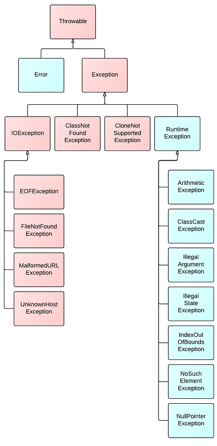

# Java Quiz

## Core Java

### Low coupling and high cohesion

Cohesion refers to what the class (or module) will do.
Low cohesion would mean that the class does a great variety of actions and is not focused on what it should do.
High cohesion would then mean that the class is focused on what it should be doing, i.e. only methods relating to the intention of the class.

Example of Low Cohesion:

```
class Staff {
  boolean checkEmail();
  void sendEmail();
  boolean emailValidate();
  void printLetter();
}
```

Example of High Cohesion:

```
class Staff {
  private Integer salary;
  private String emailAddr;

  void setSalary(newSalary);
  Integer getSalary();
  void setEmailAddr(newEmail);
  String getEmailAddr();
}
```

As for coupling, it refers to how related are two classes / modules and how dependent they are on each other.
Being low coupling would mean that changing something major in one class should not affect the other.
High coupling would make your code difficult to make changes as well as to maintain it, as classes are coupled closely together, making a change could mean an entire system revamp.

All good software design will go for **high cohesion and low coupling**.

### Exception Hierarchy

* checked (red) - must either be caught at compile time or declared in the method's throws clause
* unchecked (green) - not expected to be recovered, such as null pointer, divide by 0, etc.



### Reference types

* strong reference
* soft reference
* weak reference
* phantom reference
  
## Collections

## Threads

### synchronized vs ReenterLock

* synchronized is structured
* ReentrantLock is unstructured, i.e. you don't need to use a block structure for locking and can even hold a lock across methods.

```
private ReentrantLock lock;

public void foo() {
  ...
  lock.lock();
  ...
}

public void bar() {
  ...
  lock.unlock();
  ...
}
```
Aside from that, ReentrantLock supports lock polling and interruptable lock waits that support time-out.
ReentrantLock also has support for configurable fairness policy, allowing more flexible thread scheduling.

When should you use ReentrantLocks?

Use it when you actually need something it provides that synchronized doesn't:
* timed lock waits
* interruptable lock waits
* non-block-structured locks
* multiple condition variables
* lock polling.

## Patterns

## Memory model

### Happens Before

* monitor releasing happens-before this monitor acquiring
* write to volatile variable happens-before read from this volatile variable
```
public class Example {
    private volatile Data data = null;

    public Data getData() {
        if (data == null) {
            synchronized(this) {
                if (data == null) {
                    data = new Data();
                }
            }
        }
        return data;
    }
}
``` 
* write to final field (static and non-static) during object construction happens-before this object writing to any variable happens outer this constructor
```
public class Singleton {    
    private Singleton() {}
    private static class InstanceContainer {
        private static final Singleton instance = new Singleton();
    }
    public Singleton getInstance() {
        return InstanceContainer.instance;
    }
}
```

