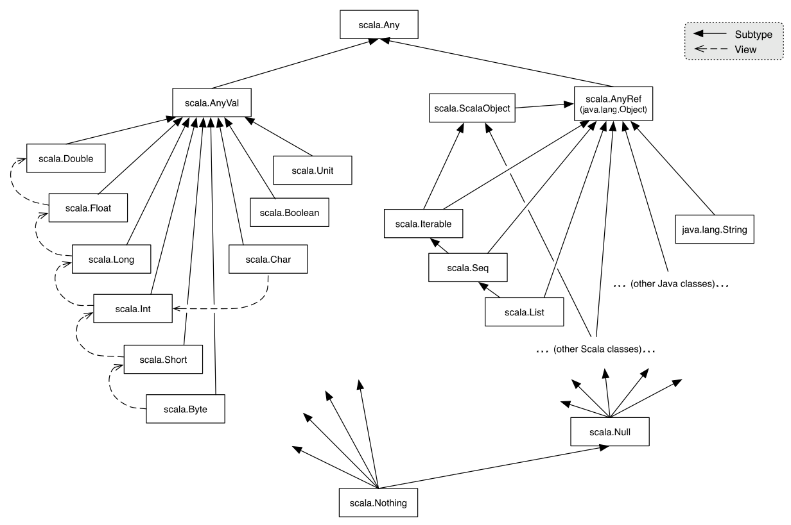
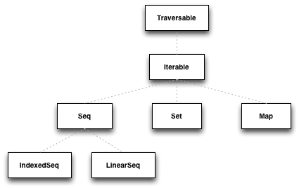
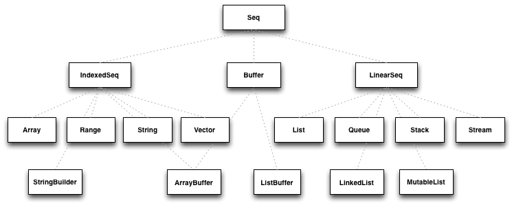
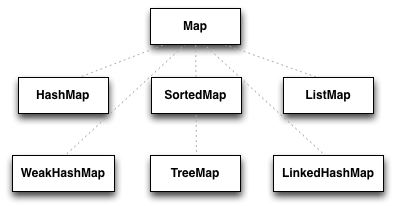
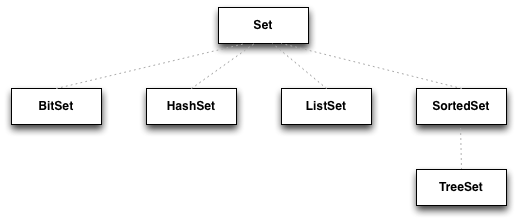

# Scala Quiz

## Core Scala

### Type Hierarchy



### Nil, Null, None, Nothing

* **None** is the empty representation of the Option
* **Null** is a Scala trait, where null is its only instance. The null value comes from Java and it’s an instance of any object, i.e., it is a subtype of all reference types, but not of value types. It exists so that reference types can be assigned null and value types (like Int or Long) can’t.
* **Nothing** is another Scala trait. It’s a subtype of any other type, and it has no subtypes. It exists due to the complex type system Scala has. It has zero instances. It’s the return type of a method that never returns normally, for instance, a method that always throws an exception. The reason Scala has a bottom type is tied to its ability to express variance in type parameters.
* **Nil** represents an empty List of anything of size zero. Nil is of type **List[Nothing]**.

### Unit
    
* Unit is a type which represents the absence of value, just like Java void
* It is a subtype of scala.AnyVal
* There is only one value of type Unit, represented by (), and it is not represented by any object in the underlying runtime system

### var, a val, def

* **var** is a variable. It’s a mutable reference to a value
* **val** is a value. It’s an immutable reference, meaning that its value never changes.
* **def** creates a method. It is evaluated on call
* **lazy val** is a val, but its value is only computed when needed
* **function**

### lazy val drawbacks

* definition
```
class LazyVal {
  lazy val value: Int = 42
}
```
* implementation
```
class LazyVal {
  @volatile var bitmap_0: Boolean = false
  var value_0: Int = _
  private def value_lzycompute(): Int = {
    this.synchronized {
      if (!bitmap_0) {
        value_0 = 42
        bitmap_0 = true
      }
    }
    value_0
  }
  def value = if (bitmap_0) value_0 else value_lzycompute()
}
```

### call-by-value vs call-by-name
   
* **call-by-value** is computed before calling the function
* **call-by-name** is evaluated when accessed

### trait vs abstract class

* a class can only extend one other class, but an unlimited number of traits
* traits only support type parameters, abstract classes can have constructor parameters
* abstract classes are interoperable with Java
* traits are only interoperable with Java if they do not contain any implementation

### object vs class

* class is definition of state and behavior
* object is definition of state, behavior and a singleton instance of this definition 

### companion object
    
* has the same name that a class
* has access to methods of private visibility of the class, and the class also has access to private methods of the object
* has to be defined in the same source file that the class
    
### case class

* syntactic sugar for a class that is immutable and decomposable through pattern matching
* contain a companion object which holds the apply, unapply, copy methods
* compared by structural equality instead of being compared by reference

### value class

* wrap primitive types into more meaningful types
* no penalties from allocating runtime objects

```
class Id(id: Int) extends AnyVal
```

### unapply and apply

* apply is a special method that allows you to write someObject(params) instead of someObject.apply(params)
* apply usage is common in case classes, which contain a companion object with the apply method that allows the nice syntax to instantiate a new object without the new keyword.
* unapply is a method that needs to be implemented by an object in order for it to be an extractor
* Extractors are used in pattern matching to access an object constructor parameters. It’s the opposite of a constructor.

### implicit parameter precedence

Compiler implicits look up order:

1. implicits declared locally
1. imported implicits
1. outer scope (implicits declared in the class are considered outer scope in a class method for instance)
1. inheritance
1. package object
1. implicit scope like companion objects

### function currying
    
* technique of making a function that takes multiple arguments into a series of functions that take a part of the arguments

### High Order Functions
    
* functions that can receive or return other functions
 
Examples:

```
.filter
.map
.flatMap
```
    
### Tail recursion

* all the computations are done before the recursive call
* and the last statement is the recursive call
* compilers can then take advantage of this property to avoid stack overflow errors, since tail recursive calls can be optimized by not inserting info into the stack
* use @tailrec to enforce tail recursion compiler    

```
def sum(n: Int): Int = {
  if(n == 0) {
    n
  } else {
    n + sum(n - 1)
  }
}
```
```
> sum(5)
sum(5)
5 + sum(4) // computation on hold => needs to add info into the stack
5 + (4 + sum(3))
5 + (4 + (3 + sum(2)))
5 + (4 + (3 + (2 + sum(1))))
5 + (4 + (3 + (2 + 1)))
15
```
```
@tailrec
def tailSum(n: Int, acc: Int = 0): Int = {
  if(n == 0) {
    acc
  } else {
    tailSum(n - 1, acc + n)
  }
}
```
```
> tailSum(5)
tailSum(4, 5) // no computations on hold
tailSum(3, 9)
tailSum(2, 12)
tailSum(1, 14)
tailSum(0, 15)
15
```

## Monads

### layman’s definition

* Something that has map and flatMap functions

### Option

* **Option** is the solution to the null problem from Java
* **Option** always knows in which cases it may have to deal with the absence of value

```
val o: Option[T] = ...
o match {
  case Some(v) =>
  case None =>
}
```
### Try

* monad approach to the Java try/catch block
* wraps runtime exceptions
 
### Either

* specify two possible return type - **successful** and **error** cases

### Option vs Try vs Either
    
* represent a computation that did not executed as expected

### yield
    
* generates a value to be kept in each iteration of a loop
* is used in for comprehensions as to provide a syntactic alternative to the combined usage of map/flatMap and filter operations on monads
    
```
for (i <- 1 to 5) yield i * 2
```

### for comprehension

* alternative syntax for the composition of several operations on monads
* can be replaced by foreach operations (if no yield keyword is being used)
* can be replaced by map/flatMap and filter

```
for {
  x <- c1
  y <- c2
  z <- c3 if z > 0
} yield {...}
```
```
c1.flatMap(x => c2.flatMap(y => c3.withFilter(z => z > 0).map(z => {...})))
```

## Collections

### Traversable and Iterable



### Sequences



### Maps



### Sets



## Threads

### Java future vs Scala future

Scala implementation is in fact asynchronous without blocking, while in Java you can’t get the future value without blocking.
* Java Future - the only way to retrieve a value is the get method
* Scala Future - a real non-blocking computation, as you can attach callbacks for completion (success/failure) or simply map over it and chain multiple Futures together in a monadic fashion

## Patterns